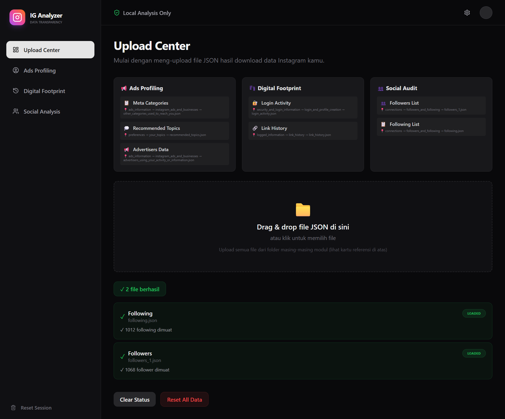
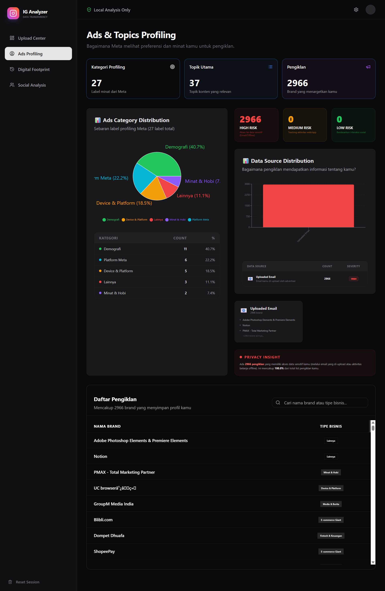
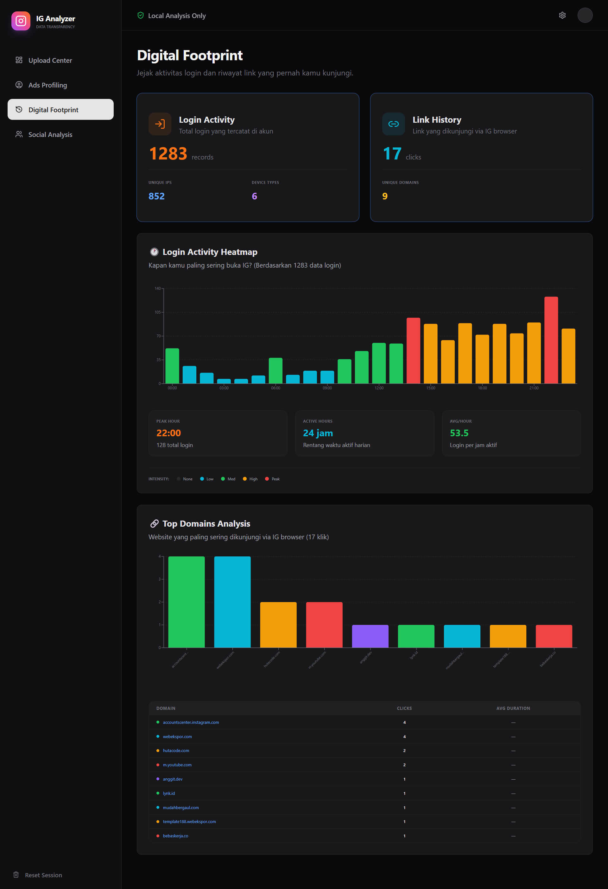
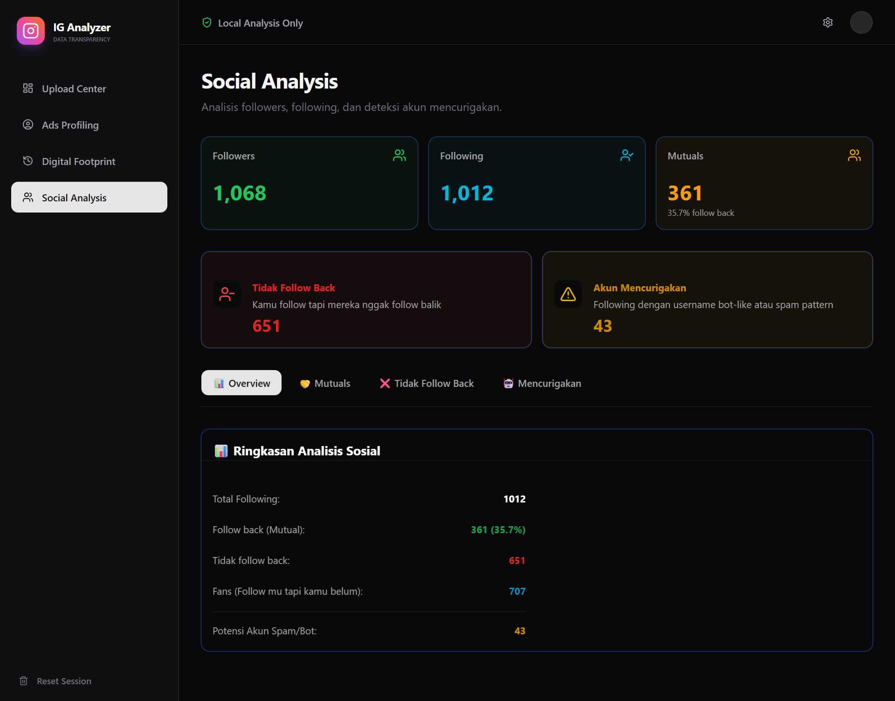

# IG Intelligence Dashboard 🔍📊

> **Local Instagram Data Audit Tool** — Transparansi data Meta dalam satu dashboard interaktif yang premium dan privacy-first.

## 🎯 Overview

Dashboard ini menganalisis data Instagram kamu yang di-export dari Meta, memberikan insight mendalam yang biasanya tersembunyi di balik ribuan baris file JSON. Project ini berfokus pada visualisasi yang "berisik" tapi informatif dan keamanan data 100% lokal.

### Key Features
✅ **Privacy-First**: Semua processing dilakukan local di browser (tidak ada data yang dikirim ke server).
✅ **Smart Classification**: AI-powered categorization untuk bisnis (13+ kategori), data source, & privacy risk.
✅ ✅ **Deep Visualization**: Interactive Heatmap, pie charts, dan bar charts menggunakan Recharts.
✅ **Mobile Responsive**: Dashboard dioptimalkan untuk tampilan HP dengan Mobile Navigation Bar.
✅ **Security Focused**: Severity scoring untuk menilai seberapa jauh privasi kamu terancam oleh pengiklan.

---

## 🏗️ Architecture & Tech Stack

### Tech Stack
- **Framework**: [Next.js 14](https://nextjs.org/) (App Router)
- **Language**: [TypeScript](https://www.typescriptlang.org/)
- **Styling**: [Tailwind CSS](https://tailwindcss.com/)
- **State Management**: [Zustand](https://docs.pmnd.rs/zustand/)
- **Visualization**: [Recharts](https://recharts.org/)
- **Icons**: [Lucide React](https://lucide.dev/)

### Architecture Diagram
```text
┌─────────────────────────────────────────────────┐
│         Meta Data Export (JSON)                 │
│  ads_interests.json, login_activity.json, dll.  │
└──────────────┬──────────────────────────────────┘
               │
               ▼
        ┌─────────────┐
        │ UploadZone  │ ◄── Auto-detect filename & status
        └──────┬──────┘
               │
               ▼
    ┌──────────────────────┐
    │   Data Parsers       │
    │ ┌──────────────────┐ │
    │ │ Ads Profiling    │ │ ◄── 13+ Category Classification
    │ │ Digital Footprint│ │ ◄── Device & UA Detection
    │ │ Social Audit     │ │ ◄── Bot & Relationship Analysis
    │ └──────────────────┘ │
    └──────────┬───────────┘
               │
               ▼
        ┌──────────────┐
        │  Zustand     │ ◄── Persistent Global State
        │   Store      │
        └──────┬───────┘
               │
               ▼
    ┌──────────────────────┐
    │   Components         │
    │ ┌──────────────────┐ │
    │ │ ProfilingModule  │ │
    │ │ FootprintModule  │ │
    │ │ SocialModule     │ │
    │ └──────────────────┘ │
    └──────────┬───────────┘
               │
               ▼
    ┌──────────────────────┐
    │   Charts & Tables    │
    │  (Recharts, Tailwind)│
    └──────────────────────┘

💡 100% Client-Side | No Backend | No Data Transmission
```

---

## 📊 Modules Insight

## 📈 Visualization & Modules

### 1. Upload Centre (Overview)

Pintu masuk utama untuk proses data. Sistem auto-detect file yang kamu masukkan dan memberikan status real-time.

### 2. Ads Profiling Module

Menganalisis bagaimana Meta melabeli kamu dan siapa saja yang memiliki data kamu.
- **Kategori Bisnis**: Mengelompokkan pengiklan ke dalam 13+ kategori (Fintech, E-commerce, Health, dll).
- **Data Source Analysis**: Mendeteksi cara pengiklan mendapatkan data kamu (Email upload, Website tracking, dll).
- **Privacy Insight**: Memberikan skor tingkat risiko (High/Medium/Low) berdasarkan akses data pengiklan.

### 3. Digital Footprint Module

Menganalisis jejak digital teknis kamu selama menggunakan platform.
- **Login Heatmap**: Visualisasi jam-jam aktif kamu di Instagram.
- **Device & OS Analysis**: Mendeteksi perangkat dan browser yang pernah digunakan.
- **Top Domains**: Ranking website yang paling sering kamu kunjungi via IG in-app browser.

### 4. Social Audit Module

Analisis hubungan followers/following.
- **Bot Detection**: Heuristic patterns untuk mendeteksi username mencurigakan.
- **Mutual Check**: Mencari siapa yang tidak follow balik secara instan.

---

## 🚀 Getting Started

### Prerequisites
- Node.js 18+
- npm / yarn / pnpm

### Installation

```bash
# Clone repository
git clone https://github.com/RozyBrt/ig-transparency-dashboard.git
cd ig-transparency-dashboard

# Install dependencies
npm install

# Run development server
npm run dev
```

Buka [http://localhost:3000](http://localhost:3000) di browser kamu.

---

## 🤝 Collaboration & Credits

Project ini adalah hasil kolaborasi antara ide manusia dan eksekusi AI:

- **Ide & Quality Assurance**: [Rozi](https://github.com/RozyBrt)
- **Blueprint & Arsitektur**: [Claude AI](https://claude.ai/) (Memberikan struktur folder, definisi tipe data, dan pola store).
- **Implementasi & Eksekusi**: [Antigravity AI](https://gemini.google.com/) (Membangun logic parser, implementasi UI/UX, integrasi grafik, dan perbaikan teknis).

---

## 🔐 Privacy & Security

Aplikasi ini tidak memiliki database atau backend. Semua data yang kamu upload hanya berada di memory browser kamu dan akan hilang saat tab ditutup. **Kami tidak pernah melihat, menyimpan, atau mengirim data kamu ke mana pun.**

---

## 📄 License

Project ini dilisensikan di bawah [MIT License](LICENSE). Bebas digunakan untuk keperluan personal atau pembelajaran.

---

**Built with ❤️ for Data Transparency**
